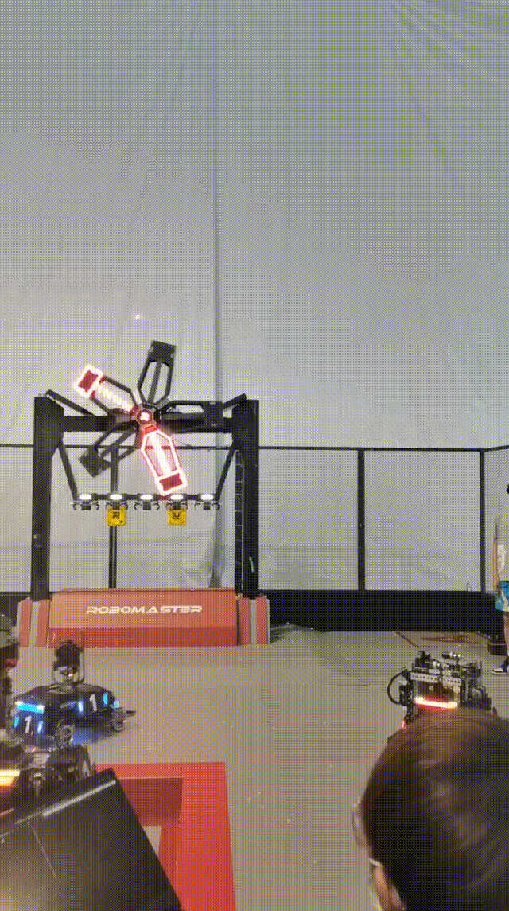
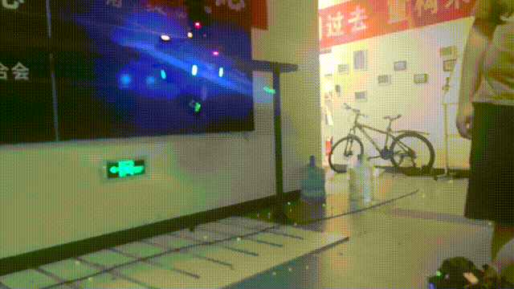
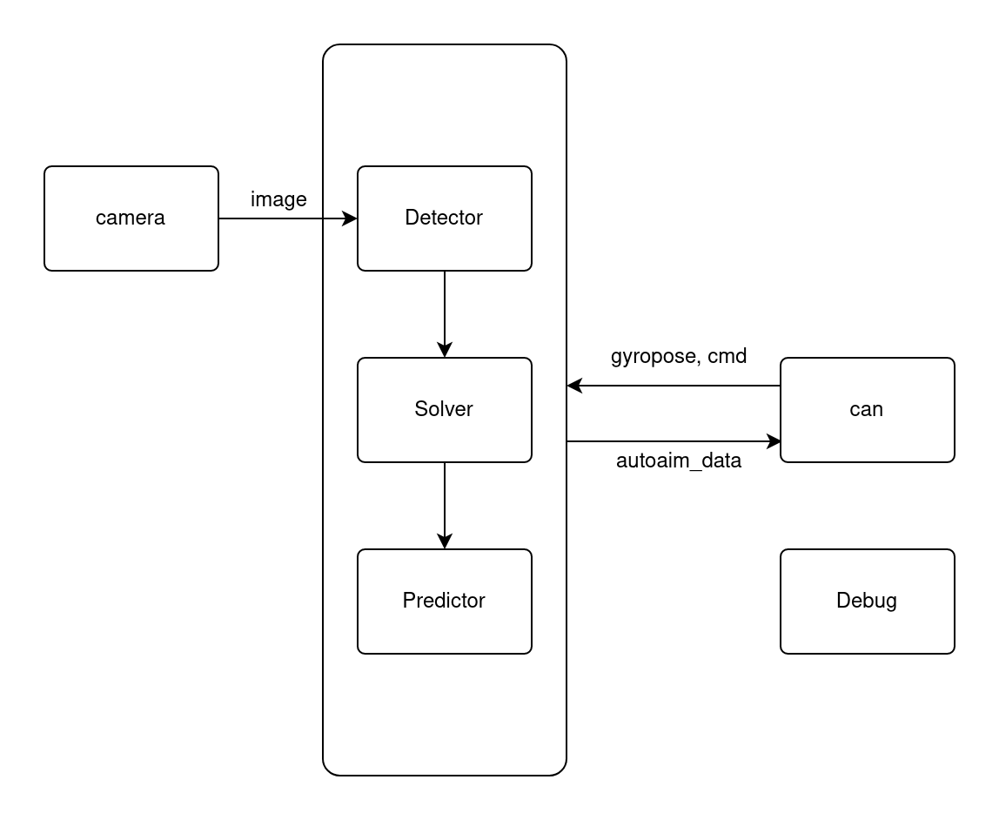
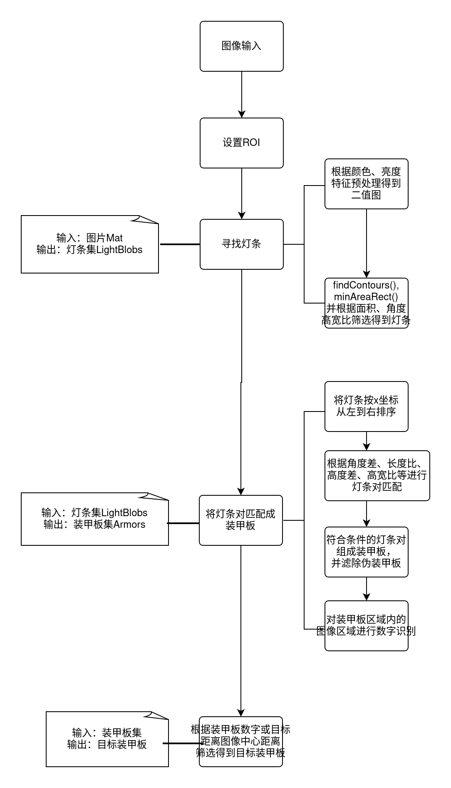

# RoboMaster2022 IRobot 步兵视觉代码开源

## 0. 写在前面

本代码为IRobot 战队 2022年RM比赛中的步兵视觉代码，包含了能量机关击打实现。如有问题可咨询本人`摸王nya（QQ:2495217894）`。

这是我从本赛季入队后就一直写到赛季结束的代码，里面的架构（太屎了）、注释、命名等多多少少可能会存在着一些问题，各种模块耦合也是粗茶淡饭，以及缺少系统的设计。虽然实战效果并不是很好，因为很多技术问题（反小陀螺、测距不稳等）并没有突破，但却确实也实现了一些功能（运动预测、能量机关）。关于能量机关的技术报告我在我的另一篇帖子里已经放出了，但由于是一个晚上赶出来的，可能会存在着一些勘误，在`Algorithm`目录下也有。

最近这段时间也是在忙着各种实验作业、新人培训、读论文之类的琐事，腾不出时间来对这份代码作出什么修改。只能说希望看的人不要找上门骂我呜呜呜。





## 1. 环境依赖

```
Ubuntu>=18.04
OpenCV==4.4.0
Eigen>=3.3
CMake>=3.5
大恒Galaxy驱动
```

## 2. 文件树

```
├── Algorithm
├── CMakeLists.txt
├── Configure					# 参数文件
│   ├── Debug.xml
│   ├── param
│   ├── RuneParam.xml
│   └── Settings.xml
├── include
│   ├── Armor					# 装甲板识别模块
│   │   ├── ArmorBox.h
│   │   ├── ArmorDetector.h
│   │   ├── classfier.h			# Eigen数字识别
│   │   ├── CV_Classifier.h		# 弃用
│   │   └── SpinDetector.h
│   ├── Const					# 常量及一些结构体
│   │   ├── const.h
│   │   └── rm_types.h
│   ├── Debug					# 调试模块
│   │   ├── Debug.h
│   │   └── DebugParam.h
│   ├── Extend					
│   │   ├── Mat_time.h			# Mat+陀螺仪四元数
│   │   └── Tools.h				# 一些处理工具
│   ├── ImageProgress			# 多线程
│   │   └── ImageProgress.h
│   ├── mercure					# 大恒mer系列相机驱动
│   │   ├── DxImageProc.h
│   │   ├── GxIAPI.h
│   │   └── mercure_driver.h
│   ├── Rune					# 能量机关
│   │   ├── 打符追踪状态处理.png
│   │   ├── Fitting.h
│   │   ├── README.md
│   │   ├── RuneBox.h
│   │   └── RuneDetector.h
│   ├── Serial					# 通信
│   │   ├── CanSerial.h			# can通信接口
│   │   └── Serial.h			# 串口通信，弃用
│   └── Solver
│       ├── CoordConvert.h
│       ├── EKF.h				# 弃用
│       ├── Predictor.h
│       └── Solver.h
├── README.md
└── src
    ├── Armor
    │   ├── ArmorBox.cpp
    │   ├── ArmorDetector.cpp
    │   ├── classfier.cpp			
    │   ├── CV_Classifier.cpp		
    │   └── SpinDetector.cpp
    ├── Debug
    │   └── Debug.cpp
    ├── Extend
    │   ├── Mat_time.cpp
    │   └── Tools.cpp
    ├── ImageProgress
    │   └── ImageProgress.cpp
    ├── main.cpp
    ├── mercure
    │   ├── CMakeLists.txt
    │   ├── libgxiapi.so
    │   └── mercure_driver.cpp
    ├── Rune
    │   ├── Fitting.cpp
    │   ├── RuneBox.cpp
    │   └── RuneDetector.cpp
    ├── Serial
    │   ├── CanSerial.cpp			
    │   └── Serial.cpp					
    └── Solver
        ├── EKF.cpp						
        ├── Predictor.cpp
        └── Solver.cpp
```

## 3. 编译运行

编译

```bash
mkdir build
cd build
cmake ..
make 	# or use threading by add '-j8'
```

开启can口

```bash
sudo ip link set can0 type can bitrate 1000000    #设置波特率
sudo ifconfig can0 up    # 使能can口
```

运行

```bash
./Autoaim	# run!
```

## 4. 整体框架



**camera**: 相机模块，采集图像

**Detector**: 识别检测模块，分为*ArmorDetector*和*RuneDetector*，前者检测一般装甲板后者检测能量机关装甲板

**Solver**:  PnP位姿解算

**Predictor**: 预测模块，包括弹道解算，KF预测（能量机关运动预测为Fitting）

**can**: can通信模块

**Debug**: 调试模块，通过设置`Configure/Debug.xml`的参数来选择开启调试功能

## 5. 主要模块介绍

下面主要介绍一般装甲板的识别、预测等策略，关于能量机关的识别、预测见`docs`下的技术报告

### 5.1 ArmorDetector

*ArmorDetector*是对一般装甲板的识别检测模块



其中对于装甲板的数字识别分类，我们使用的是自己使用Eigen实现的CNN网络（由于一定的历史原因使用，并不代表比一般训练的网络更优秀）。其输入图像预处理过程为: 

1. 选取灯条内装甲板ROI区域并进行适当扩大，为灰度图
2. resize为（28，28）
3. gamma矫正处理，增亮

最后输出为0~10的数字，其所代表含义如下：

```
{"base", "hero", "engineer", "infantry3", "infantry4", "infantry5", "sentry", "outpost", "error101", "error010", "error111"};
```


### 5.2 Predictor

预测使用的是匀速运动模型的卡尔曼滤波，需要利用IMU数据处理得到的四元数将目标在相机系下的坐标转换到IMU的惯性系下。
$$
p_{k+1} = p_k + v_k t
$$
卡尔曼滤波的Q、R矩阵参数在`Configure\Settings.xml`目录下，建议自己写一个简单的Python脚本来对卡尔曼滤波的实际作用进行仿真，可以对卡尔曼滤波有更直观的感受。也可以参考我的一篇简单的博客：[对于卡尔曼滤波器的一些理解和探讨](https://blog.csdn.net/qq_52967097/article/details/123230837)

关于匀加速模型，我实际使用时其实并没有多好的效果，反而平白增添了好几个参数，而且卡尔曼滤波是对线性模型的滤波，而匀加速已经是非线性了，如果想使用匀加速模型可以考虑EKF，本项目中虽然并没有实际使用EKF，但还是内置了一个使用ceres实现的EKF，如果感兴趣可以尝试一下。

## 6. 关于未来优化的方向

1. 反小陀螺
2. 深度学习检测识别
3. 使用ROS2的框架进行更好的模块划分
